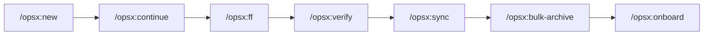

# `/opsx:` 指令完整使用指南

> 以 **YT_to_MP3** 專案為實例，面向團隊教育訓練

---

## 先搞清楚：兩套系統的關係

你問得很好 —— 之前列出的那些 Skill（`idea-refine`、`spec-driven-development`、`test-driven-development`…）和你實際使用的 `/opsx:` 指令是 **兩套不同的系統**，但有概念上的對應關係。

### 架構圖

```
┌─────────────────────────────────────────────────────────────┐
│  Antigravity 內建 Skills（你不會直接呼叫）                    │
│  idea-refine, spec-driven-development, planning...          │
│  → Agent 內部的「方法論知識庫」                                │
│  → 告訴 Agent「怎樣做才是對的」                               │
└──────────────────────────┬──────────────────────────────────┘
                           │ 理念內化
                           ▼
┌─────────────────────────────────────────────────────────────┐
│  OpenSpec CLI + /opsx: 指令（你實際使用的工具）                │
│  /opsx:propose, /opsx:apply, /opsx:verify...                │
│  → 具體的工作流程指令                                         │
│  → 「按這個順序做事，產出這些文件」                             │
└─────────────────────────────────────────────────────────────┘
```

### 簡單比喻

| | 內建 Skills | `/opsx:` 指令 |
|---|---|---|
| **是什麼** | 方法論 / 知識 | 操作工具 / 工作流 |
| **類比** | 「做菜的技巧」（刀工、火候、調味原則） | 「食譜步驟」（第一步切菜、第二步熱鍋…） |
| **誰使用** | Agent 內部自動引用 | **你直接輸入指令** |
| **存在位置** | `C:\Users\Danny\.gemini\antigravity\skills\` | `.claude\commands\opsx\` + `.claude\skills\openspec-*` |

> [!IMPORTANT]
> **結論：你只需要學會 `/opsx:` 指令就好。** 內建 Skills 是 Agent 的「內功」，會在 `/opsx:` 指令執行過程中自動被運用。例如當你執行 `/opsx:propose` 時，Agent 內部就是在用 `spec-driven-development` 和 `planning-and-task-breakdown` 的方法論來產出規格和任務。

---

## `/opsx:` 指令總覽

### 核心工作流（必學的 4 個）


### 輔助指令（進階使用）



---

## 核心指令詳解

---

### 1️⃣ `/opsx:explore` — 探索思考

> **「先想清楚再動手」**

| 項目 | 說明 |
|------|------|
| **用途** | 在動手之前，先探索問題、調查程式碼、比較方案 |
| **重點** | **只思考，不寫 code** |
| **產出** | 沒有固定產出，可能是一段分析、一張 ASCII 圖、或一個結論 |

#### 使用情境

```
你：/opsx:explore 我想讓下載支援 MP4 格式，但不確定 yt-dlp 要怎麼設定

Agent 會做的事：
1. 讀取 backend/main.py 中現有的 run_download() 邏輯
2. 調查 yt-dlp 的 format selector 語法
3. 畫出現有架構圖
4. 列出可能的實作方案與優缺點
5. 等你決定方向
```

#### 何時使用

- ✅ 需求模糊，還不確定要做什麼
- ✅ 想比較兩種技術方案
- ✅ 想了解一段不熟悉的程式碼
- ✅ 除錯前想先分析問題
- ❌ 已經知道要做什麼了（→ 直接用 `/opsx:propose`）

---

### 2️⃣ `/opsx:propose` — 提案 + 產出所有文件

> **「一鍵從構想到任務清單」**

| 項目 | 說明 |
|------|------|
| **用途** | 建立一個 change，並自動產出全部規劃文件 |
| **產出** | `proposal.md` + `specs/` + `design.md` + `tasks.md` |
| **下一步** | `/opsx:apply` |

#### 使用方式

```
你：/opsx:propose download-format-quality
或
你：/opsx:propose 我想讓使用者選擇下載 MP3 或 MP4 和品質
```

#### Agent 自動產出的文件

```
openspec/changes/download-format-quality/
├── .openspec.yaml       ← 變更中繼資料（自動產生）
├── proposal.md          ← 為什麼要做？改了什麼？影響哪些檔案？
├── specs/
│   └── download-format-quality/
│       └── spec.md      ← 具體需求：WHEN/THEN 驗收條件
├── design.md            ← 技術決策：怎麼實作？用什麼方案？
└── tasks.md             ← 任務清單：勾選式步驟
```

#### 專案實例 — `proposal.md` 長這樣

```markdown
## Why
使用者目前只能下載 MP3 192kbps，希望支援 MP4 影片格式和不同品質選擇。

## What Changes
- 前端新增格式/品質下拉選單
- POST /download API 新增 format, quality 參數
- 後端 run_download() 依格式切換 yt-dlp 設定

## Capabilities
### New Capabilities
- `download-format-quality`: 格式與品質選擇機制

## Impact
- `frontend/src/components/SelectedVideosPanel.vue`: 新增下拉選單
- `backend/main.py`: 修改 download endpoint 和 run_download()
```

#### 專案實例 — `tasks.md` 長這樣

```markdown
## 1. 前端 UI
- [ ] 1.1 在 SelectedVideosPanel 新增「格式」下拉選單 (MP3/MP4)
- [ ] 1.2 新增「品質」下拉選單，依格式聯動選項
- [ ] 1.3 下載請求攜帶 format 與 quality 參數

## 2. 後端 API
- [ ] 2.1 POST /download 接收 format, quality 參數
- [ ] 2.2 run_download() 依 format 分派 yt-dlp 設定
- [ ] 2.3 缺欄位時 fallback 為 mp3/192

## 3. 驗證
- [ ] 3.1 測試 MP3 預設行為不變
- [ ] 3.2 測試 MP4 720p 下載
```

---

### 3️⃣ `/opsx:apply` — 執行實作

> **「按照任務清單逐步寫 code」**

| 項目 | 說明 |
|------|------|
| **用途** | 讀取 tasks.md，逐項實作並打勾 |
| **前提** | 已有 `tasks.md`（通常由 `/opsx:propose` 產出） |
| **下一步** | `/opsx:verify` 或 `/opsx:archive` |

#### 使用方式

```
你：/opsx:apply download-format-quality
或
你：/opsx:apply        ← 如果只有一個 active change，會自動選取
```

#### Agent 做的事

```
## Implementing: download-format-quality

Working on task 1/7: 在 SelectedVideosPanel 新增「格式」下拉選單
  → 修改 frontend/src/components/SelectedVideosPanel.vue
  → 新增 <select> 元素與 v-model 綁定
✓ Task complete

Working on task 2/7: 新增「品質」下拉選單，依格式聯動
  → 新增 computed 屬性切換選項
  → 切換格式時自動重置品質預設值
✓ Task complete

Working on task 3/7: POST /download 接收 format, quality
  → 修改 backend/main.py 的 download endpoint
✓ Task complete

... (逐項完成)

## Implementation Complete
Progress: 7/7 tasks complete ✓
All tasks complete! You can archive with /opsx:archive.
```

#### 中途暫停

如果你需要中斷，Agent 會記住進度。下次再執行 `/opsx:apply` 會從上次停的地方繼續。

---

### 4️⃣ `/opsx:archive` — 歸檔完成的變更

> **「完工入庫」**

| 項目 | 說明 |
|------|------|
| **用途** | 將完成的 change 移到 `archive/` 目錄，並同步 spec |
| **產出** | `openspec/changes/archive/2026-05-20-download-format-quality/` |

#### 使用方式

```
你：/opsx:archive download-format-quality
```

#### Agent 做的事

1. **檢查任務完成度** — 如果有未完成的 task 會警告
2. **同步規格** — 將 change 裡的 delta spec 合併到 `openspec/specs/` 主規格
3. **搬移目錄** — `changes/download-format-quality/` → `changes/archive/2026-05-20-download-format-quality/`

```
## Archive Complete

Change: download-format-quality
Archived to: openspec/changes/archive/2026-05-20-download-format-quality/
Specs: ✓ Synced to main specs

All artifacts complete. All tasks complete.
```

---

## 輔助指令詳解

---

### 5️⃣ `/opsx:new` — 逐步建立變更

> **`/opsx:propose` 的「慢速版」**

| 差異 | `/opsx:propose` | `/opsx:new` |
|------|-----------------|-------------|
| 速度 | 一次產出所有文件 | 一次只產出一個文件 |
| 控制 | 較少介入機會 | 每步都可以審閱和修改 |
| 適合 | 小到中型功能 | 大型功能、需要仔細斟酌 |

#### 使用方式

```
你：/opsx:new video-stream-playback

Agent：建立了 change 目錄，這是 proposal 的 template，
      要我開始寫嗎？

你：好，開始

Agent：proposal.md 寫好了。執行 /opsx:continue 寫下一個文件。
```

---

### 6️⃣ `/opsx:continue` — 繼續下一個文件

> **搭配 `/opsx:new` 使用**

```
你：/opsx:continue video-stream-playback

Agent：上次完成了 proposal.md，接下來寫 specs...
      （產出 spec.md）
      
      ✓ Created specs. 執行 /opsx:continue 繼續寫 design.md。
```

每次只產出一個 artifact，讓你有空間審閱修改。

---

### 7️⃣ `/opsx:ff` — 快速推進

> **跟 `/opsx:propose` 幾乎相同**

差別在於 `/opsx:ff` 用於「已經存在的 change 補齊剩餘文件」，而 `/opsx:propose` 是「從零開始建立 + 補齊」。

---

### 8️⃣ `/opsx:verify` — 驗證實作

> **「程式碼有照規格做嗎？」**

| 項目 | 說明 |
|------|------|
| **用途** | Archive 前的品質把關 |
| **檢查維度** | 完整性、正確性、一致性 |

#### Agent 產出的驗證報告

```
## Verification Report: download-format-quality

### Summary
| Dimension    | Status                    |
|--------------|---------------------------|
| Completeness | 7/7 tasks, 4/4 reqs      |
| Correctness  | 4/4 reqs covered          |
| Coherence    | Design followed           |

### Issues
🟢 No critical issues found.

⚠️ WARNINGS:
- Scenario "缺欄位時走預設" has no dedicated test
  → Recommendation: Add test in backend/tests/

✅ Ready for archive.
```

---

### 9️⃣ `/opsx:sync` — 同步規格

> **將 change 裡的規格合併到主規格**

通常在 `/opsx:archive` 時自動執行，但也可以手動呼叫。

```
你：/opsx:sync download-format-quality

Agent：
  Updated main specs:
  - download-format-quality:
    - Added requirement: "下載格式選項"
    - Added requirement: "品質選項依格式聯動"
    - Added requirement: "下載請求攜帶格式與品質"
    - Added requirement: "後端依格式調度 yt-dlp"
```

---

### 🔟 `/opsx:bulk-archive` — 批次歸檔

> **一次 archive 多個完成的 change**

```
你：/opsx:bulk-archive

Agent：
  找到 3 個 active changes：
  ☑ download-format-quality (7/7 tasks)
  ☑ sidebar-layout (5/5 tasks)
  ☐ video-stream-playback (2/6 tasks, 未完成)

  要歸檔哪些？
```

可以偵測 spec 衝突（兩個 change 改到同一個 spec）並自動解決。

---

### 1️⃣1️⃣ `/opsx:onboard` — 新手教學

> **帶著你走完一整個工作流程循環**

```
你：/opsx:onboard

Agent：
  歡迎！我會帶你用一個真實的小任務，
  走過完整的 explore → propose → apply → archive 流程。
  約 15-20 分鐘...
```

**建議團隊新成員第一次使用時先跑一次 `/opsx:onboard`。**

---

## 完整工作流程圖

以「新增下載格式選擇」功能為例：

```
 ① 有個模糊想法
     │
     ▼
 /opsx:explore
 「我想讓 App 也能下載 MP4，要怎麼改？」
     │  Agent 調查 yt-dlp、分析現有程式碼、列出方案
     │
     ▼
 ② 想法明確了
     │
     ▼
 /opsx:propose download-format-quality
     │  自動產出：proposal.md, spec.md, design.md, tasks.md
     │
     ▼
 ③ 審閱文件 OK
     │
     ▼
 /opsx:apply download-format-quality
     │  逐項實作 tasks.md 中的任務
     │  每完成一項打勾 ✓
     │
     ▼
 ④ 全部實作完成
     │
     ▼
 /opsx:verify download-format-quality （可選）
     │  驗證程式碼 vs 規格的一致性
     │
     ▼
 /opsx:archive download-format-quality
     │  同步 spec + 搬到 archive/
     │
     ▼
 ⑤ 完成！
```

---

## 速查表

| 我想... | 用這個指令 |
|---------|-----------|
| 💭 先想想怎麼做 | `/opsx:explore` |
| 📋 從頭規劃一個功能 | `/opsx:propose <name>` |
| 📋 慢慢規劃、逐步審閱 | `/opsx:new <name>` → `/opsx:continue` |
| 🔨 開始寫 code | `/opsx:apply <name>` |
| ✅ 檢查做得對不對 | `/opsx:verify <name>` |
| 📦 完工歸檔 | `/opsx:archive <name>` |
| 📦 批次歸檔 | `/opsx:bulk-archive` |
| 🔄 同步規格 | `/opsx:sync <name>` |
| 🎓 第一次學習 | `/opsx:onboard` |

---

## 內建 Skills 如何在背後運作

| 你執行的指令 | Agent 背後用到的 Skills |
|---|---|
| `/opsx:explore` | `idea-refine`、`context-engineering` |
| `/opsx:propose` | `spec-driven-development`、`planning-and-task-breakdown`、`api-and-interface-design` |
| `/opsx:apply` | `incremental-implementation`、`frontend-ui-engineering`、`source-driven-development` |
| `/opsx:verify` | `code-review-and-quality`、`test-driven-development` |
| `/opsx:archive` | `documentation-and-adrs`、`git-workflow-and-versioning` |

> [!TIP]
> **你不需要記住內建 Skills。** 只要學會 `/opsx:` 指令，Agent 會自動選用對的方法論。就像你不需要知道引擎怎麼運作，只要會踩油門和方向盤就好。
